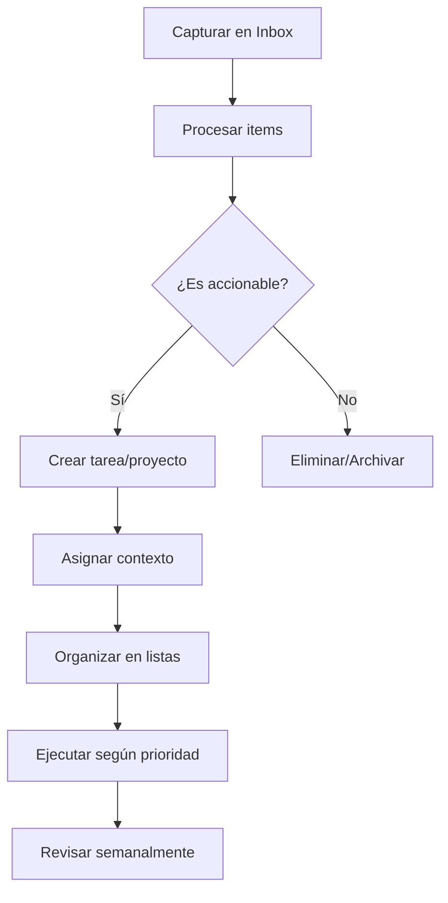
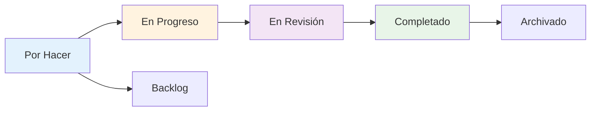
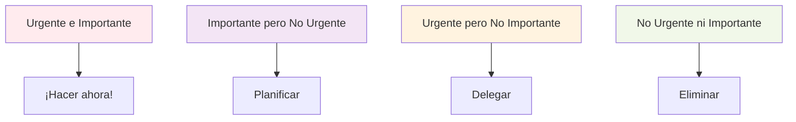

# Plan de Implementación: Sistema Avanzado de Gestión de Proyectos y Tareas

## Análisis de Metodologías Implementadas

### 1. GTD (Getting Things Done)
- **Bandeja de entrada**: Captura rápida de tareas sin procesar
- **Procesamiento**: Clasificación y organización de tareas
- **Listas contextuales**: @trabajo, @casa, @teléfono, @computadora
- **Revisión semanal**: Sistema de revisión y actualización
- **Ejecución**: Priorización por contexto, tiempo y energía

### 2. Kanban
- **Columnas personalizables**: Por Hacer, En Progreso, En Revisión, Completado
- **Límite WIP**: Control de trabajo en progreso
- **Arrastrar y soltar**: Movimiento visual de tareas
- **Métricas de flujo**: Tiempo de ciclo, throughput

### 3. Matriz de Eisenhower
- **Cuadrantes**: Urgente/Importante, No Urgente/Importante, Urgente/No Importante, No Urgente/No Importante
- **Visualización**: Interfaz de matriz 2x2
- **Reasignación**: Movimiento entre cuadrantes
- **Colores**: Codificación visual por prioridad

### 4. MoSCoW
- **Must have**: Crítico para el éxito
- **Should have**: Importante pero no crítico
- **Could have**: Deseable pero no necesario
- **Won't have**: Excluido de este ciclo

## Arquitectura del Sistema

### Modelos de Datos Propuestos

```python
# Sistema de etiquetas mejorado
class TagCategory(models.Model):
    name = models.CharField(max_length=50)  # GTD, Priority, Context, Custom
    description = models.TextField()
    color = models.CharField(max_length=7, default="#007bff")
    icon = models.CharField(max_length=50, blank=True)

class Tag(models.Model):
    name = models.CharField(max_length=50)
    category = models.ForeignKey(TagCategory, on_delete=models.CASCADE)
    color = models.CharField(max_length=7, default="#6c757d")
    description = models.TextField(blank=True)
    is_system = models.BooleanField(default=False)  # Para etiquetas predefinidas

# Dependencias entre tareas
class TaskDependency(models.Model):
    task = models.ForeignKey('Task', on_delete=models.CASCADE, related_name='dependencies')
    depends_on = models.ForeignKey('Task', on_delete=models.CASCADE, related_name='blocking')
    dependency_type = models.CharField(max_length=20, choices=[
        ('finish_to_start', 'Finalizar para comenzar'),
        ('start_to_start', 'Comenzar para comenzar'),
        ('finish_to_finish', 'Finalizar para finalizar'),
        ('start_to_finish', 'Comenzar para finalizar')
    ])

# Plantillas de proyectos
class ProjectTemplate(models.Model):
    name = models.CharField(max_length=200)
    description = models.TextField()
    category = models.CharField(max_length=100)
    estimated_duration = models.IntegerField(help_text="Duración en días")
    is_public = models.BooleanField(default=False)

class TemplateTask(models.Model):
    template = models.ForeignKey(ProjectTemplate, on_delete=models.CASCADE)
    title = models.CharField(max_length=200)
    description = models.TextField(blank=True)
    order = models.IntegerField()
    estimated_hours = models.DecimalField(max_digits=6, decimal_places=2)
    required_skills = models.ManyToManyField('Skill', blank=True)

# Inbox para GTD
class InboxItem(models.Model):
    title = models.CharField(max_length=200)
    description = models.TextField(blank=True)
    created_at = models.DateTimeField(auto_now_add=True)
    created_by = models.ForeignKey(User, on_delete=models.CASCADE)
    is_processed = models.BooleanField(default=False)
    processed_at = models.DateTimeField(null=True, blank=True)
    processed_to = models.ForeignKey('Task', null=True, blank=True, on_delete=models.SET_NULL)

# Recordatorios mejorados
class Reminder(models.Model):
    title = models.CharField(max_length=200)
    description = models.TextField(blank=True)
    remind_at = models.DateTimeField()
    task = models.ForeignKey('Task', null=True, blank=True, on_delete=models.CASCADE)
    project = models.ForeignKey('Project', null=True, blank=True, on_delete=models.CASCADE)
    event = models.ForeignKey('Event', null=True, blank=True, on_delete=models.CASCADE)
    created_by = models.ForeignKey(User, on_delete=models.CASCADE)
    is_sent = models.BooleanField(default=False)
    reminder_type = models.CharField(max_length=20, choices=[
        ('email', 'Email'),
        ('push', 'Push Notification'),
        ('both', 'Email y Push')
    ])
```

### Vistas y URLs Propuestas

```python
# urls.py
urlpatterns = [
    # Vistas Kanban
    path('kanban/', KanbanBoardView.as_view(), name='kanban_board'),
    path('kanban/project/<int:project_id>/', ProjectKanbanView.as_view(), name='project_kanban'),

    # Matriz de Eisenhower
    path('eisenhower/', EisenhowerMatrixView.as_view(), name='eisenhower_matrix'),

    # Inbox GTD
    path('inbox/', InboxView.as_view(), name='inbox'),
    path('inbox/process/<int:item_id>/', ProcessInboxItemView.as_view(), name='process_inbox_item'),

    # Dashboard unificado
    path('dashboard/', UnifiedDashboardView.as_view(), name='unified_dashboard'),

    # Plantillas
    path('templates/', ProjectTemplateListView.as_view(), name='template_list'),
    path('templates/create/', ProjectTemplateCreateView.as_view(), name='template_create'),
    path('templates/<int:template_id>/use/', UseTemplateView.as_view(), name='use_template'),

    # API para funcionalidades avanzadas
    path('api/tasks/dependencies/', TaskDependencyAPIView.as_view(), name='task_dependencies_api'),
    path('api/workflow/automate/', WorkflowAutomationAPIView.as_view(), name='workflow_automation'),
]
```

## Diagramas de Arquitectura

### Flujo de Trabajo GTD



### Vista Kanban



### Matriz de Eisenhower



## Interfaces de Usuario

### 1. Dashboard Unificado

**Características:**
- Vista general de todos los proyectos y tareas
- Métricas de productividad
- Accesos rápidos a diferentes metodologías
- Alertas y recordatorios
- Gráficos de progreso

### 2. Vista Kanban

**Características:**
- Columnas personalizables
- Tarjetas con información resumida
- Drag & drop entre columnas
- Filtros por etiquetas y asignados
- Indicadores visuales de prioridad

### 3. Matriz de Eisenhower

**Características:**
- Cuadrantes visuales 2x2
- Drag & drop entre cuadrantes
- Colores diferenciados
- Filtros por fecha y proyecto
- Estadísticas de distribución

### 4. Inbox GTD

**Características:**
- Captura rápida de items
- Procesamiento por lotes
- Conversión automática a tareas
- Integración con calendario
- Recordatorios contextuales

## Funcionalidades Avanzadas

### 1. Sistema de Dependencias

```python
# Ejemplo de uso
task_a = Task.objects.get(title="Diseñar UI")
task_b = Task.objects.get(title="Programar frontend")
task_c = Task.objects.get(title="Testing")

# Crear dependencia: task_b depende de task_a
TaskDependency.objects.create(
    task=task_b,
    depends_on=task_a,
    dependency_type='finish_to_start'
)
```

### 2. Automatización de Workflows

```python
# Ejemplo de regla automática
class AutoAssignWorkflow:
    def process_task_completed(self, task):
        if task.title.startswith("Review:"):
            # Crear automáticamente tarea de corrección
            correction_task = Task.objects.create(
                title=f"Corregir: {task.title}",
                project=task.project,
                assigned_to=task.assigned_to,
                task_status=TaskStatus.objects.get(name="To Do")
            )
```

### 3. Time Tracking Avanzado

```python
class AdvancedTimeTracker:
    def start_tracking(self, task):
        # Iniciar cronómetro
        pass

    def stop_tracking(self, task):
        # Detener y calcular tiempo
        pass

    def generate_report(self, user, period):
        # Reportes detallados por proyecto/tarea
        pass
```

## Plan de Implementación

### Fase 1: Fundamentos (Semanas 1-2)
1. [x] Analizar metodologías existentes
2. [ ] Diseñar sistema de etiquetas mejorado
3. [ ] Crear modelos de datos base
4. [ ] Implementar sistema de dependencias
5. [ ] Desarrollar API base

### Fase 2: Interfaces Principales (Semanas 3-4)
1. [ ] Implementar vista Kanban
2. [ ] Crear bandeja de entrada GTD
3. [ ] Desarrollar matriz de Eisenhower
4. [ ] Construir dashboard unificado
5. [ ] Añadir navegación entre vistas

### Fase 3: Funcionalidades Avanzadas (Semanas 5-6)
1. [ ] Implementar plantillas de proyectos
2. [ ] Mejorar sistema de recordatorios
3. [ ] Desarrollar automatización de workflows
4. [ ] Añadir time tracking avanzado
5. [ ] Implementar filtros avanzados

### Fase 4: Optimización y Testing (Semanas 7-8)
1. [ ] Optimizar rendimiento
2. [ ] Testing exhaustivo
3. [ ] Documentación completa
4. [ ] Entrenamiento de usuarios
5. [ ] Despliegue en producción

## Consideraciones Técnicas

### Integración con Sistema Existente
- Aprovechar los managers existentes (EventManager, ProjectManager, TaskManager)
- Extender modelos actuales sin romper funcionalidad
- Mantener compatibilidad con interfaces existentes
- Preservar datos históricos

### Rendimiento
- Lazy loading para grandes conjuntos de datos
- Caching inteligente de consultas frecuentes
- Paginación en todas las vistas de lista
- Indexación de base de datos optimizada

### Seguridad
- Validación de permisos en todas las operaciones
- Sanitización de datos de entrada
- Protección contra ataques comunes
- Auditoría de cambios sensibles

### Escalabilidad
- Arquitectura modular para fácil extensión
- APIs REST para integración futura
- Soporte para múltiples bases de datos
- Configuración flexible de características

## Conclusión

Este plan proporciona una hoja de ruta completa para transformar el sistema actual de gestión de proyectos en una solución integral que incorpora las mejores prácticas de múltiples metodologías. El enfoque gradual asegura que cada fase construya sobre la anterior, minimizando riesgos y permitiendo ajustes basados en retroalimentación real de usuarios.

La arquitectura propuesta es flexible y extensible, permitiendo la adición futura de nuevas metodologías o características según las necesidades evolucionen.